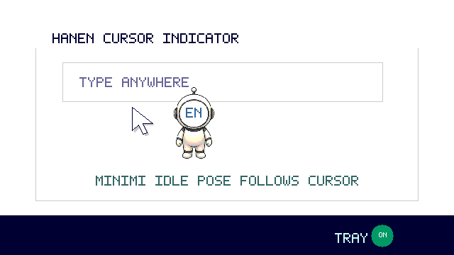

# HanEn Cursor Indicator

Windows-only tray app that shows the current Korean/English input mode next to the mouse cursor.
마우스 커서 바로 옆에 현재 입력 상태를 `한` / `en` / `EN`으로 표시하는 Windows 전용 앱입니다.



## Commercial Launch / 수익화 출시

This public repository is now treated as the product documentation, demo, issue, and launch-prep repository.
The paid executable and production secrets are distributed through the web license flow, not through GitHub.

- Web MVP: [`web/`](web/)
- Database schema: [`web/supabase/schema.sql`](web/supabase/schema.sql)
- Launch checklist: [`docs/commercial-launch-checklist.md`](docs/commercial-launch-checklist.md)
- Target distribution: website checkout first, Microsoft Store second
- First product: `Personal Lifetime`, 2 PC activations, 14-day offline grace period

## Usage Example / 사용 예시

1. 웹에서 받은 실행 파일 또는 로컬 개발 빌드 `CursorImeIndicator.exe`를 실행합니다.
2. 설치 과정 없이 바로 실행되고 Windows 트레이 아이콘이 추가됩니다.
3. 한글 입력 상태에서는 미니미 얼굴에 `한`이 표시됩니다.
4. 영어 소문자 입력 상태에서는 `en`, 대문자 입력 상태에서는 `EN`이 표시됩니다.
5. 입력 상태가 바뀌면 미니미가 1초 동안 마우스를 가리킨 뒤 정자세로 돌아옵니다.
6. 일정 주기마다 만세 포즈가 표시됩니다.

## Download

The commercial build is downloaded from the official website after license verification. GitHub should not publish the paid executable.

For local development builds, run:

```bat
build.bat
```

The local build output is `CursorImeIndicator.exe`. Package that file privately for the website/Microsoft Store flow.

## Windows Support

- Windows 10 / Windows 11
- No separate installer required
- Built with the .NET Framework compiler included on Windows

## Included Mascot Images

The default image pack uses three shared pose files:

| Pose | File | Behavior |
| --- | --- | --- |
| Idle | `dist/images/idle.png` | Shown when the mouse cursor is still |
| Point | `dist/images/point.png` | Shown for 1 second after input mode changes |
| Cheer | `dist/images/cheer.png` | Shown while the mouse cursor is moving |

The app draws `한`, `en`, or `EN` on the mascot face at runtime, so the basic pack only needs three pose images.

## Character Concepts

See [`list/`](list/) for 13 original mascot concept images and an animated preview GIF.
Ready-to-use 3-pose packs are in [`list/packs/`](list/packs/).

## Custom Images / 이미지 추가

To replace the mascot, put images next to the exe. You can use either a 3-image shared pack or a 9-image state pack.

Fastest path: right-click the tray icon, choose the image picker, select 3-image shared mode or 9-image state mode, choose the state/pose slot, then pick a file. The app copies it into `dist/images/` with the correct slot filename and reloads it immediately.

### 3-image shared pack

Use three pose images. The app draws `한`, `en`, or `EN` on top of the same image set:

```text
dist/
  HanEnCursorIndicator.exe
  images/
    idle.png
    point.png
    cheer.png
```

### 9-image state pack

Use separate images for each input state and pose. The app picks the image by current state + current pose:

```text
dist/
  HanEnCursorIndicator.exe
  images/
    ko-idle.png
    ko-point.png
    ko-cheer.png
    en-idle.png
    en-point.png
    en-cheer.png
    upper-idle.png
    upper-point.png
    upper-cheer.png
```

State names inside the app are `ko`, `en`, and `EN`. `EN-idle.png`, `EN-point.png`, and `EN-cheer.png` are also supported, but Windows folders are usually case-insensitive, so `upper-*` is the safer filename set when you also have `en-*` files in the same folder.

Supported image formats:

```text
images/idle.gif
images/idle.png
images/idle.jpg
images/idle.jpeg
images/idle.jfif
images/idle.bmp

images/point.gif
images/point.png
images/point.jpg
images/point.jpeg
images/point.jfif
images/point.bmp

images/cheer.gif
images/cheer.png
images/cheer.jpg
images/cheer.jpeg
images/cheer.jfif
images/cheer.bmp

images/ko-idle.png
images/en-idle.png
images/upper-idle.png
```

The app searches in this order: GIF, PNG, JPG, JPEG, JFIF, BMP.

Tips:

- Use transparent PNG files for clean static mascot poses.
- Use animated GIF files if you want a moving pose.
- With a 3-image pack, leave a blank face area; the app draws `한`, `en`, or `EN` automatically.
- With a 9-image pack, you can include the text directly in each image and turn off `글자 표시` from the tray menu.
- Right-click the tray icon and choose `이미지 폴더 열기` to open the correct folder.
- After changing files, choose `커스텀 이미지 다시 불러오기`.
- Choose `이미지 누끼 처리` from the tray menu to select one or more images and save transparent `*-cutout.png` copies. It samples the outer edge color to remove connected backgrounds, falls back to a centered subject mask for complex photos, and the default option shrinks large images to a lightweight 160px app-ready PNG.
- Turn on `라인으로 누끼 보정` in the cutout options to draw correction lines before saving.
- Use `윤곽 안쪽만 남기기` and drag around the outside contour of the subject; the app closes the outline and removes everything outside it. Use `배경 라인 제거` only when drawing on a background area that should be removed.

## Size Control / 크기 조정

Right-click the tray icon and open `크기`.

- Choose a preset: `50%`, `75%`, `100%`, `125%`, `150%`, `200%`, `250%`.
- Choose `드래그로 크기 조정` to open a slider.
- Drag the slider with the mouse to tune the size gain by percentage.
- The selected percentage is saved and reused next time.

## Label Position Control / 글자 위치 조정

Right-click the tray icon and choose `글자 위치 조정`.

- Choose a state: `ko`, `en`, or `EN`.
- Choose a pose: `Idle`, `Point`, or `Cheer`.
- Drag the blue point anywhere on the image preview to place the label center.
- The app saves label positions separately for each state + pose combination.
- Use `기본값` to reset the selected state + pose.

## Label Toggle / 글자 표시

Right-click the tray icon and toggle `글자 표시`.

- On: the app draws `한`, `en`, or `EN` over the mascot.
- Off: the mascot image follows the cursor without drawing extra text.
- This is useful when a 9-image pack already has the face text inside each image.

## Mascot Color / 미니미 색상

Right-click the tray icon and open `미니미 색상`.

- `기본 색상 선택`: choose the normal mascot clothing color.
- `상태별 색상 사용`: turn on different clothing colors for Korean and English states.
- `한글 색상 선택`: clothing color used when the label is `한`.
- `영어 소문자 색상 선택`: clothing color used when the label is `en`.
- `영어 대문자 색상 선택`: clothing color used when the label is `EN`.
- `글씨 색상`: choose separate face-label colors for `한`, `en`, and `EN`.
- The face label stays readable while the body/clothing area is recolored.

## Voice / Supertone TTS

Right-click the tray icon and open `보이스`.

- Turn on `드래그 텍스트 읽기` to read selected text after a mouse drag.
- Open `Supertone API 설정` and enter your own API Key, Voice ID, language, model, style, speed, and max text length.
- The API Key is saved per Windows user with Windows DPAPI encryption at `%APPDATA%\HanEnCursorIndicator\supertone.key`.
- The API Key is not saved in `settings.ini`, not included in Git, and is never shown again in the settings window.
- Drag selection uses a brief `Ctrl+C` copy, sanitizes the copied text, restores the previous clipboard data, and then calls Supertone.
- Symbols and separators such as `-`, `ㅡ`, `_`, `@`, `#`, and emoji are removed so they are not spoken as symbol names.
- Text is capped at 300 characters to match Supertone's Text to Speech API limit.
- `클립보드 텍스트 테스트` reads the current clipboard text so you can test without dragging.

Supported model names in the settings menu follow the Supertone API docs: `sona_speech_1`, `sona_speech_2`, `sona_speech_2_flash`, `sona_speech_2t`, and `supertonic_api_1`.

## License / 라이선스

Right-click the tray icon and open `라이선스`.

- `라이선스 등록`: enter the web license server URL and the purchased license key.
- `라이선스 상태`: validates online when possible and falls back to the encrypted offline token.
- `이 PC 비활성화`: frees the current PC activation.
- License keys and offline tokens are saved per Windows user with Windows DPAPI encryption under `%APPDATA%\HanEnCursorIndicator`.
- The Windows app contains only the public API URL and never includes Paddle, Supabase, Toss, or email service secret keys.
- A paid license supports 2 PC activations and 14 days of offline use by default.

## Animation Effects

- Input-mode changes use a subtle pop animation.
- `point.png` appears for 1 second after the language state changes.
- `idle.png` appears while the mouse cursor is still.
- `cheer.png` appears while the mouse cursor is moving.
- State-specific files such as `ko-point.png` or `upper-cheer.png` override the shared pose image.
- Custom animated GIF poses keep their GIF animation.
- If no custom image is found, the app falls back to the default text badge.

## Features

- Shows `한` for Korean input mode.
- Shows `en` for English lowercase mode.
- Shows `EN` for English uppercase mode, including Caps Lock / Shift state.
- Humanoid minimi mascot with 3-image or 9-image packs.
- Optional custom PNG/JPG/JPEG/JFIF/BMP/GIF images.
- Tray menu on/off toggle.
- Tray menu image slot picker.
- Tray menu image reload.
- Tray menu label visibility toggle.
- Tray menu size presets and drag slider.
- Tray menu state + pose label-position drag editor.
- Tray menu mascot color picker.
- Tray menu label color picker and background-line cutout refinement.
- Tray menu Supertone voice settings with encrypted per-PC API key storage.

## Monetization Direction

The first commercial flow is:

1. Customer buys a `Personal Lifetime` license through Paddle.
2. The web app receives Paddle `transaction.completed`.
3. The server creates a license key in Supabase.
4. The customer uses the key to download and activate the Windows app.
5. Microsoft Store registration is prepared after the web checkout flow is stable.

## Build

This project builds with the .NET Framework compiler included with Windows:

```bat
build.bat
```

The build output is `CursorImeIndicator.exe`. Commercial distributables are packaged outside GitHub.

## Demo GIF

The README animation uses the current minimi mascot pose images from `dist/images/` and is generated without external packages:

```bat
node tools/create-demo-gif.js
```

## Notes

Because this is an unsigned personal executable, Windows SmartScreen may show a warning on first run.
