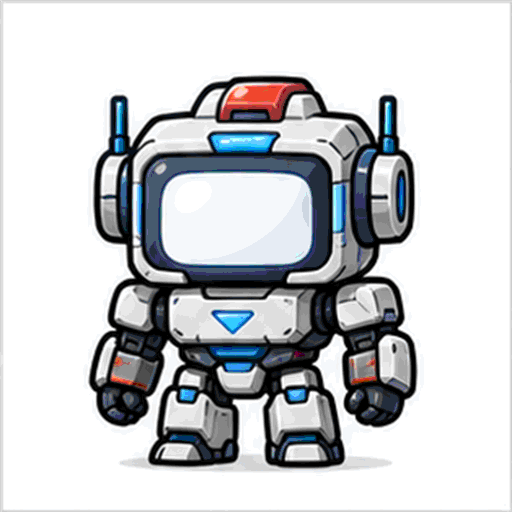

# Character Concept List

These are original mascot concepts generated for HanEn Cursor Indicator. They are inspired by broad character archetypes, not direct copies of existing franchises.

## Preview

## Top 13

| Rank | File | Concept | Why it fits |
| ---: | --- | --- | --- |
| 1 | `01-transforming-block-robot.png` | Transforming block robot | Strong tech identity and a large face screen for `한/en/EN`. |
| 2 | `04-monitor-face-robot.png` | Monitor-face robot | The clean display face makes language labels feel native. |
| 3 | `03-red-armor-helmet-hero.png` | Red armor helmet hero | Premium and energetic, good for a more heroic app mascot. |
| 4 | `05-astronaut-helmet-mascot.png` | Astronaut helmet mascot | Rounded visor works well as a label area. |
| 5 | `02-yellow-helper-capsule.png` | Yellow helper capsule | Friendly and approachable for everyday utility software. |
| 6 | `10-round-capsule-service-robot.png` | Round service robot | Simple silhouette, easy to recolor for `ko/en/EN`. |
| 7 | `06-keyboard-helper.png` | Keyboard helper | Directly communicates input and typing. |
| 8 | `09-work-suit-pointer-guide.png` | Pointer guide | Best match for a mouse-following assistant behavior. |
| 9 | `13-neon-cyber-assistant.png` | Neon cyber assistant | Modern, high-contrast, good for dark UI branding. |
| 10 | `08-pixel-arcade-avatar.png` | Pixel arcade avatar | Reads well at small sizes and fits GIF demos. |
| 11 | `07-speech-bubble-head.png` | Speech-bubble head | Natural place for state labels or short text. |
| 12 | `12-sticker-face-mascot.png` | Sticker-face mascot | Cute and easy to use as a lightweight sticker pack. |
| 13 | `11-tiny-wizard-ui-helper.png` | Tiny wizard UI helper | Fun, but less directly tied to keyboard input. |

## Files

- `character-concept-sheet.png`: original generated 13-character concept sheet.
- `character-pack-preview.gif`: animated preview cycling through the 13 concepts.
- `01-*.png` through `13-*.png`: individual cropped concept images with transparent backgrounds.

For production character packs, use these as concept references and create pose sets as either 3 shared images (`idle`, `point`, `cheer`) or 9 state-specific images (`ko/en/upper` x `idle/point/cheer`).
