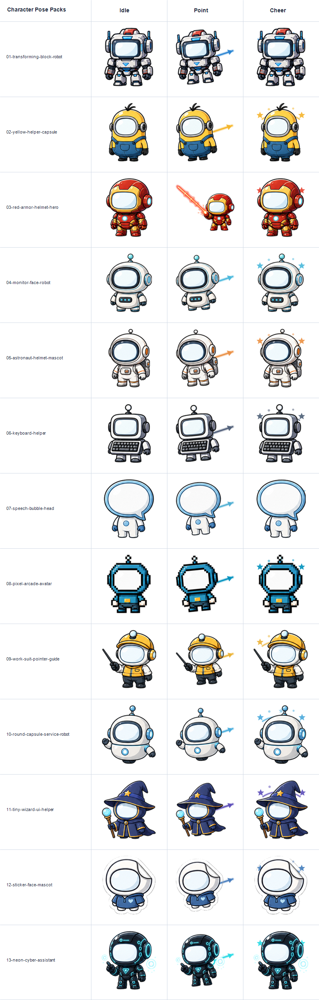

# Character Pose Packs

Each folder contains a 3-image shared mascot pack:

```text
idle.png
point.png
cheer.png
```

Copy one folder's three PNG files into the app `images/` folder next to `HanEnCursorIndicator.exe`, then choose `커스텀 이미지 다시 불러오기` from the tray menu.

## Preview



## Folders

- `01-transforming-block-robot`
- `02-yellow-helper-capsule`
- `03-red-armor-helmet-hero`
- `04-monitor-face-robot`
- `05-astronaut-helmet-mascot`
- `06-keyboard-helper`
- `07-speech-bubble-head`
- `08-pixel-arcade-avatar`
- `09-work-suit-pointer-guide`
- `10-round-capsule-service-robot`
- `11-tiny-wizard-ui-helper`
- `12-sticker-face-mascot`
- `13-neon-cyber-assistant`

All pose PNG files are lightweight `160x160` transparent-background images sized for the cursor indicator.
